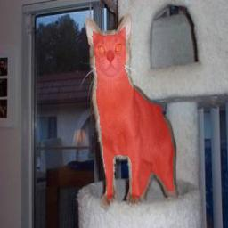

<p align="left">
  
  
  
</p>

# Oxford Pets U-Net Baseline (PyTorch)


Minimal semantic segmentation baseline on the Oxford-IIIT Pet dataset with U-Net.


## Dataset
Uses `torchvision.datasets.OxfordIIITPet` with `target_types=("segmentation")`. Masks are 1-indexed; we convert to {0,1} (pet vs background) and optionally ignore borders.


## Quickstart
```bash
# 1) create env & install deps
pip install -r requirements.txt


# 2) train (will auto-download data to ~/.torch/datasets)
python train.py --epochs 30 --batch-size 8 --lr 3e-4 --img-size 256


# 3) run single-image inference
python scripts/infer_one.py --ckpt runs/best.pt --image path/to.jpg --out out.png
## Results (baseline)
- **Test Dice:** 0.8922  
- **Test IoU:** 0.8180  
- Training config: `epochs=30`, `batch_size=8`, `lr=1e-4`, `img_size=256`

### Qualitative examples (test set)
下列為原圖與預測遮罩的疊圖（紅色為前景）：
<p float="left">
  
  
  
</p>
